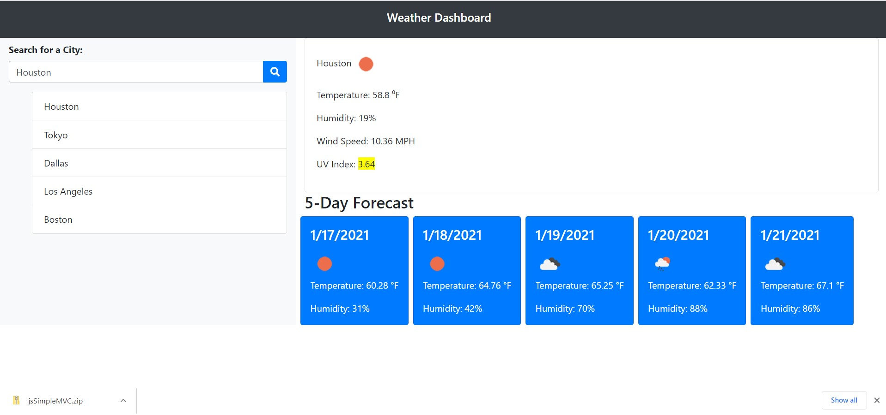

# weather-dashboard
## Description
This is  an application to find current and 5 Day forecast weather conditions of a given City.We use the Open Weather API to retrieve the data object.
The page will display the current weather in this format:
-City name, date and Icon.
-Temperature
-Humidity
-Wind Speed
-Uv index (color code depending on level)

The 5 Day forecast will be display information for everyday in this format:
-Date
-Icon
-Temperature
-Humidity

 The leftside of the page, will display the list of the cities used in previous searches. If a City name is clicked it will bring back and display the information.

 ## Languages
 JavaScript with HTML,Bootstrap.

 ## link
 The page can be found at:
<a href="https://martha121.github.io/weather-dashboard/"> martha121.github.io/weather-dashboard</a>

# Screenshot
Screenshot of main page:

 
 

 ## Screenshots:
